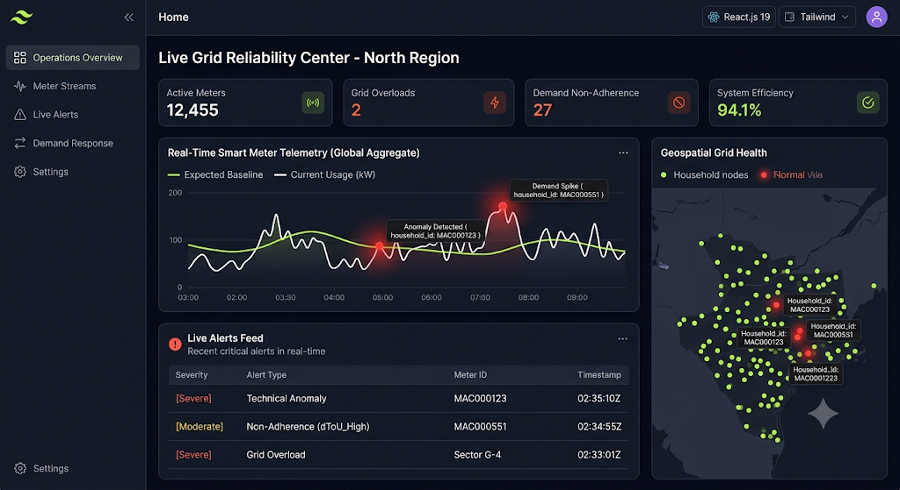

# UI Implementation Spec: Live Grid Reliability Center



This specification outlines the technical design properties, structural components, and real-time state configurations for the front-end interface layer of the Anomaly Detection System.

## 1. Global Layout Engine & Theme Config

- **Theme Archetype:** Premium Cyberpunk / Dark Operations Console.
- **Core Primitives (Tailwind CSS Tokens):**
  - Canvas Background: `bg-[#0b0f19]` (Deep Obsidian Slate)
  - Card Surfaces: `bg-[#131a26]/80` with `backdrop-blur-md` and `border border-gray-800/60`
  - Text Continuum: Base headings (`text-gray-100`), telemetry labels (`text-gray-400`), secondary values (`text-slate-400`)
- **Semantic Accent Spectrum:**
  - Normal Operational Base: `#34d399` (Emerald-400)
  - Anomaly / Threat State: `#f87171` (Red-400)
  - System Activity / Stream Ingestion: `#60a5fa` (Blue-400)

---

## 2. Component Layout & Structural Matrix

The dashboard uses a layout engine that prevents window overflow and maintains consistent scaling under streaming pressure:

## 3. Atomic Element Specifications

### Component A: High-Throughput Stream Chart (Recharts / Chart.js integration)

- **Render Architecture:** Time-series plotting with a sliding window limited to the latest 50 values to optimize client performance.
- **Data Line A (Expected Baseline Model):** Type `monotone`, stroke `#34d399`, thickness `2px`, dot mapping disabled.
- **Data Line B (Live Meter Reading Load):** Type `linear`, stroke `#ffffff`, thickness `2.5px`.
- **Custom Tooltip Trigger:** On hover, open a micro-modal showing `household_id`, exact consumption `kW`, and calculated `anomaly_score`.
- **Anomaly Intercept Nodes:** Filter real-time array state for data elements containing `anomaly_detected == true`. Generate a custom SVG node element at those coordinate spaces:
  ```jsx
  const RenderAnomalyDot = (props) => {
    const { cx, cy } = props;
    return (
      <g>
        <circle
          cx={cx}
          cy={cy}
          r={8}
          fill="#f87171"
          className="animate-ping opacity-75"
        />
        <circle
          cx={cx}
          cy={cy}
          r={4}
          fill="#ef4444"
          stroke="#ffffff"
          strokeWidth={1}
        />
      </g>
    );
  };
  ```

### Component B: Live Event Feed (Data Grid Matrix)

- **Container Box:** Wrapped inside a scrollable box with a fixed height (`h-[280px] overflow-y-auto`).
- **Column Setup:**
  1.  `Severity`: Custom badges matching text tokens: `[Severe]` uses `text-red-400 bg-red-950/40 border border-red-800/40`.
  2.  `Alert Type`: Highlighting technical malfunctions vs time-of-use (dToU) pricing violations.
  3.  `Meter ID`: Styled with a clean monospaced layout (`font-mono tracking-wider text-blue-400`).
  4.  `Timestamp`: Rendered in standard UTC format (`HH:mm:ssZ`).

---

## 4. State Orchestration (STOMP Hook Pattern)

Write a reactive state hook inside `src/hooks/useGridWebSocket.js` to handle data stream updates smoothly without page re-renders:

```javascript
import { useEffect, useState } from "react";
import { Client } from "@stomp/stompjs";

export const useGridWebSocket = (onAlertTriggered, onTelemetryTick) => {
  useEffect(() => {
    const stompClient = new Client({
      brokerURL: "ws://localhost:8080/grid-ws-broker",
      reconnectDelay: 5000,
      heartbeatIncoming: 4000,
      heartbeatOutgoing: 4000,
    });

    stompClient.onConnect = (frame) => {
      // Channel 1: High Priority Flagged Alerts
      stompClient.subscribe("/topic/live-alerts", (msg) => {
        if (msg.body) onAlertTriggered(JSON.parse(msg.body));
      });

      // Channel 2: Global Grid Monitoring Stream Ticks
      stompClient.subscribe("/topic/telemetry-ticks", (msg) => {
        if (msg.body) onTelemetryTick(JSON.parse(msg.body));
      });
    };

    stompClient.activate();
    return () => stompClient.deactivate();
  }, [onAlertTriggered, onTelemetryTick]);
};
```
